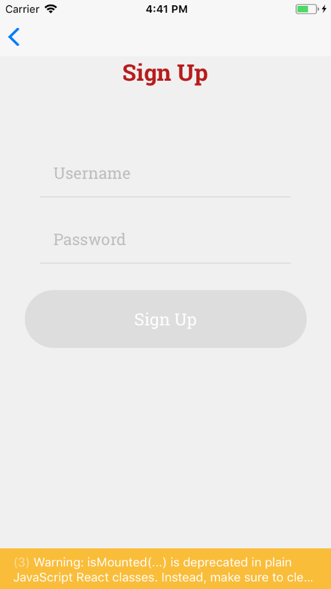
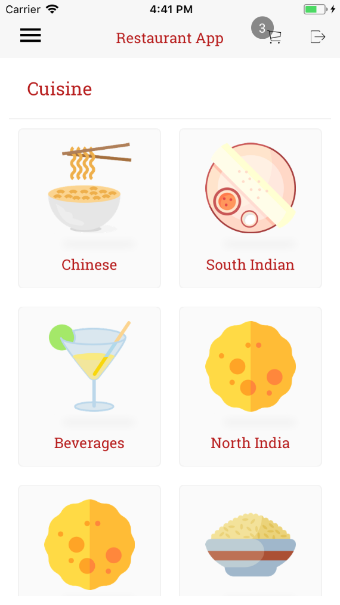

# Restaurant App
#### ScreenShots - Native App

- 运行
1.	 forward:  PC->Phone 作为Client客户端,可以任意访问Phone上的 Server 服务器  
adb forward tcp:8888 tcp:8888
reverse:反向代理  Phone->PC  
adb reverse tcp:8097 tcp:8097  
adb reverse tcp:8081 tcp:8081
8081端口的服务就是React Native项目的一个本地服务器
用于提供JSBundle包和一些静态资源

2.	npm install -g react-devtools   
配置:”scripts”:{“react-devtools”:” react-devtools”}
npm  run react-devtools

3.	android avd  命令无效，可以重启，使得环境变量彻底生效
adb devices

4.	React-native bundle --platform Android --dev false
--entry-file index.js 
--bundle-output android/app/src/main/assets/index.android.bundle 
--assets-dest android/app/src/main/res

5.	打开模拟器
D: cd D:\sdk\tools\        
emulator.exe -netdelay  none  -netspeed full -avd api23  -partition-size 2048
emulator.exe -netdelay  none  -netspeed full -avd API2301
打开模拟机dev       adb shell input keyevent 82            
C:\Users\liuniuyou\.android\avd\API2301.avd
模拟器上想要访问PC本地的localhost的话，要用10.0.2.2,有一些可能是10.0.0.2，
模拟器会映射到PC本地的localhost
